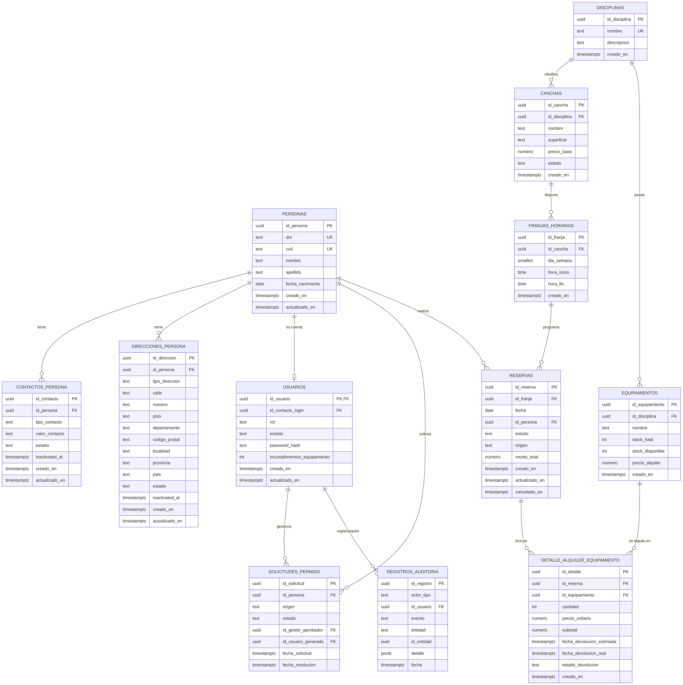

# Esquema

```mermaid
%%{init: {"theme": "default", "flowchart": {"curve": "ortho"}, "er": {"useMaxWidth": false}} }%%
erDiagram
    PERSONAS {
        uuid id_persona PK
        text dni UK
        text cuil UK
        text nombre
        text apellido
        date fecha_nacimiento
        timestamptz creado_en
        timestamptz actualizado_en
    }

    CONTACTOS_PERSONA {
        uuid id_contacto PK
        uuid id_persona FK
        text tipo_contacto
        text valor_contacto
        text estado
        timestamptz inactivated_at
        timestamptz creado_en
        timestamptz actualizado_en
    }

    DIRECCIONES_PERSONA {
        uuid id_direccion PK
        uuid id_persona FK
        text tipo_direccion
        text calle
        text numero
        text piso
        text departamento
        text codigo_postal
        text localidad
        text provincia
        text pais
        text estado
        timestamptz inactivated_at
        timestamptz creado_en
        timestamptz actualizado_en
    }

    USUARIOS {
        uuid id_usuario PK, FK
        uuid id_contacto_login FK
        text rol
        text estado
        text password_hash
        int incumplimientos_equipamiento
        timestamptz creado_en
        timestamptz actualizado_en
    }

    SOLICITUDES_PERMISO {
        uuid id_solicitud PK
        uuid id_persona FK
        text origen
        text estado
        uuid id_gestor_aprobador FK
        uuid id_usuario_generado FK
        timestamptz fecha_solicitud
        timestamptz fecha_resolucion
    }

    REGISTROS_AUDITORIA {
        uuid id_registro PK
        text actor_tipo
        uuid id_usuario FK
        text evento
        text entidad
        uuid id_entidad
        jsonb detalle
        timestamptz fecha
    }

    DISCIPLINAS {
        uuid id_disciplina PK
        text nombre UK
        text descripcion
        timestamptz creado_en
    }

    CANCHAS {
        uuid id_cancha PK
        uuid id_disciplina FK
        text nombre
        text superficie
        numeric precio_base
        text estado
        timestamptz creado_en
    }

    FRANJAS_HORARIAS {
        uuid id_franja PK
        uuid id_cancha FK
        smallint dia_semana
        time hora_inicio
        time hora_fin
        timestamptz creado_en
    }

    EQUIPAMIENTOS {
        uuid id_equipamiento PK
        uuid id_disciplina FK
        text nombre
        int stock_total
        int stock_disponible
        numeric precio_alquiler
        timestamptz creado_en
    }

    RESERVAS {
        uuid id_reserva PK
        uuid id_franja FK
        date fecha
        uuid id_persona FK
        text estado
        text origen
        numeric monto_total
        timestamptz creado_en
        timestamptz actualizado_en
        timestamptz cancelado_en
    }

    DETALLE_ALQUILER_EQUIPAMIENTO {
        uuid id_detalle PK
        uuid id_reserva FK
        uuid id_equipamiento FK
        int cantidad
        numeric precio_unitario
        numeric subtotal
        timestamptz fecha_devolucion_estimada
        timestamptz fecha_devolucion_real
        text estado_devolucion
        timestamptz creado_en
    }

    %% Relaciones
    PERSONAS ||--o{ CONTACTOS_PERSONA : "tiene"
    PERSONAS ||--o{ DIRECCIONES_PERSONA : "tiene"
    PERSONAS ||--o| USUARIOS : "es cuenta"
    PERSONAS ||--o{ SOLICITUDES_PERMISO : "solicita"
    PERSONAS ||--o{ RESERVAS : "realiza"
    
    USUARIOS ||--o{ SOLICITUDES_PERMISO : "gestiona"
    USUARIOS ||--o{ REGISTROS_AUDITORIA : "registra/actor"
    
    DISCIPLINAS ||--o{ CANCHAS : "clasifica"
    DISCIPLINAS ||--o{ EQUIPAMIENTOS : "posee"
    
    CANCHAS ||--o{ FRANJAS_HORARIAS : "dispone"
    
    FRANJAS_HORARIAS ||--o{ RESERVAS : "programa"
    
    RESERVAS ||--o{ DETALLE_ALQUILER_EQUIPAMIENTO : "incluye"
    EQUIPAMIENTOS ||--o{ DETALLE_ALQUILER_EQUIPAMIENTO : "se alquila en"
```