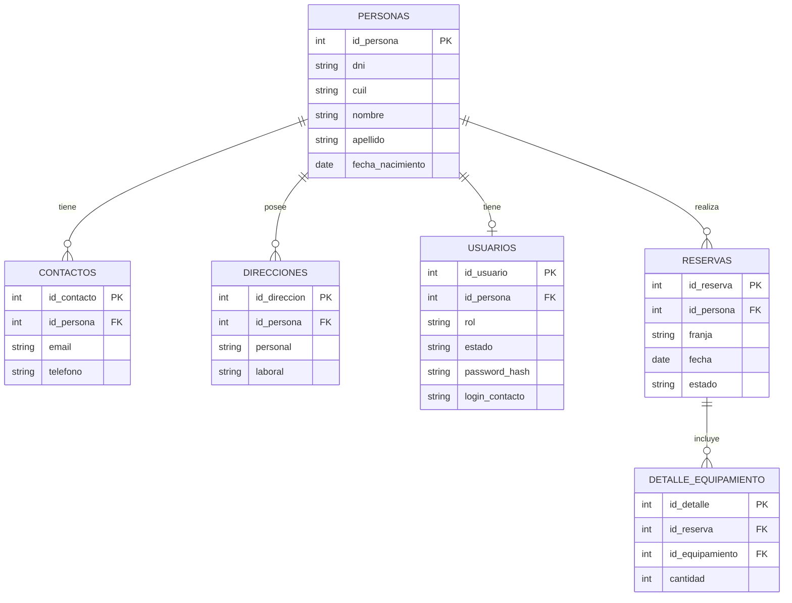

```mermaid
erDiagram
    PERSONAS ||--o{ CONTACTOS : tiene
    PERSONAS ||--o{ DIRECCIONES : posee
    PERSONAS ||--o| USUARIOS : tiene
    PERSONAS ||--o{ RESERVAS : realiza
    RESERVAS ||--o{ DETALLE_EQUIPAMIENTO : incluye

    PERSONAS {
        int id_persona PK
        string dni
        string cuil
        string nombre
        string apellido
        date fecha_nacimiento
    }

    CONTACTOS {
        int id_contacto PK
        int id_persona FK
        string email
        string telefono
    }

    DIRECCIONES {
        int id_direccion PK
        int id_persona FK
        string personal
        string laboral
    }

    USUARIOS {
        int id_usuario PK
        int id_persona FK
        string rol
        string estado
        string password_hash
        string login_contacto
    }

    RESERVAS {
        int id_reserva PK
        int id_persona FK
        string franja
        date fecha
        string estado
    }

    DETALLE_EQUIPAMIENTO {
        int id_detalle PK
        int id_reserva FK
        int id_equipamiento FK
        int cantidad
    }
```