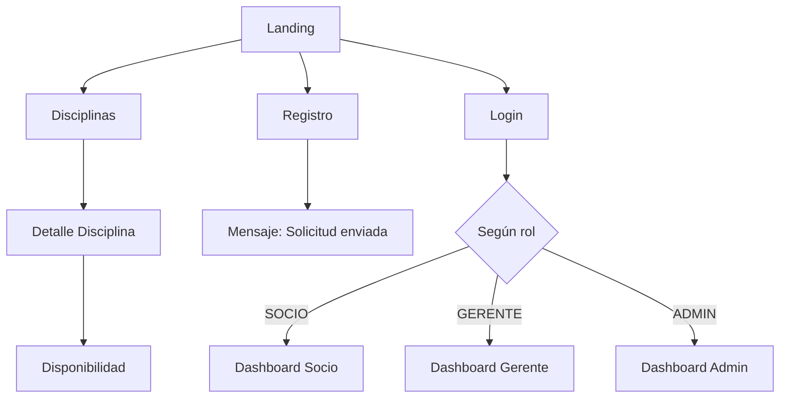
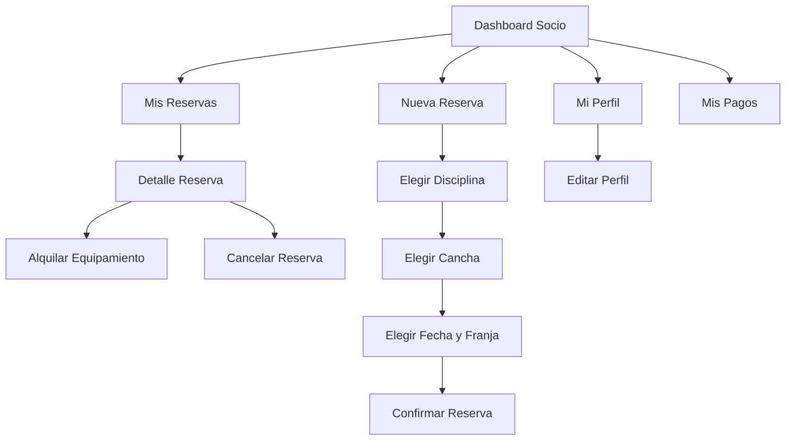
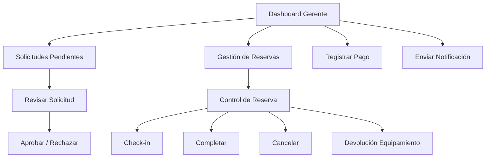
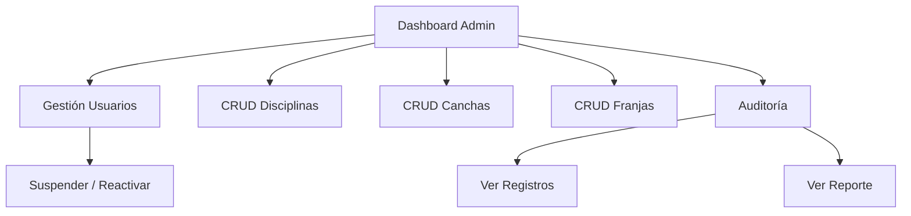

# 📱 Pantallas de la Aplicación — Club Deportivo

> **Versión:** 1.0  
> **Fecha:** 2026-09-28  
> **Basado en:** API REST `api/v1` — NestJS + Prisma + PostgreSQL

---

## 🗂️ Índice

1. [Resumen de roles](#1-resumen-de-roles)
2. [Pantallas públicas (sin autenticación)](#2-pantallas-públicas-sin-autenticación)
3. [Pantallas del Socio](#3-pantallas-del-socio)
4. [Pantallas del Gerente](#4-pantallas-del-gerente)
5. [Pantallas del Administrador](#5-pantallas-del-administrador)
6. [Flujos de navegación](#6-flujos-de-navegación)

---

## 1. Resumen de roles

| Rol | Descripción |
|---|---|
| **Visitante** | No autenticado. Solo consulta de disciplinas, canchas y disponibilidad. |
| **SOCIO** | Usuario estándar. Puede reservar, alquilar equipamiento, ver su perfil y pagos. |
| **GERENTE** | Personal del club. Gestiona reservas, pagos, solicitudes y notificaciones. |
| **ADMINISTRADOR** | Super-admin. Control total: CRUD de instalaciones, usuarios, auditoría y reportes. |

---

## 2. Pantallas públicas (sin autenticación)

### 2.1 🏠 Landing / Inicio

**Ruta sugerida:** `/`

| Sección | Descripción | Endpoint relacionado |
|---|---|---|
| Hero | Bienvenida al club, botones de **Iniciar Sesión** y **Registrarse** | — |
| Disciplinas destacadas | Cards con las disciplinas disponibles y cantidad de canchas | `GET /disciplines` |
| ¿Cómo funciona? | Breve explicación del proceso: registrarse → ser aprobado → reservar | — |

---

### 2.2 📝 Registro de Socio

**Ruta sugerida:** `/register`

| Campo | Tipo | Requerido | Notas |
|---|---|---|---|
| DNI | Texto | ✅ | Debe ser único en el sistema |
| CUIL | Texto | ❌ | Opcional |
| Nombre | Texto | ✅ | |
| Apellido | Texto | ✅ | |
| Fecha de nacimiento | Fecha | ❌ | |
| Email | Email | ✅ | Se usará para login |
| Teléfono | Teléfono | ❌ | |
| Contraseña | Password | ✅ | Mínimo 8 caracteres |

**Acción:** `POST /auth/register`  
**Resultado:** Se crea Persona + Usuario (estado `PENDIENTE`) + Solicitud de permiso.  
**Mensaje post-registro:** *"Tu solicitud fue enviada. Un gerente la revisará pronto."*

---

### 2.3 🔐 Iniciar Sesión

**Ruta sugerida:** `/login`

| Campo | Tipo |
|---|---|
| Email | Email |
| Contraseña | Password |

**Acción:** `POST /auth/login`  
**Resultado:** JWT + datos del usuario. Redirige según rol.  
**Validaciones:** Si el usuario está `SUSPENDIDO`, se bloquea el acceso con mensaje explicativo.

---

### 2.4 🏅 Disciplinas

**Ruta sugerida:** `/disciplines`

| Elemento | Descripción |
|---|---|
| Listado de disciplinas | Cards con nombre, descripción y cantidad de canchas |
| Búsqueda / filtro | Por nombre de disciplina |

**Acción:** `GET /disciplines`

---

### 2.5 🏟️ Detalle de Disciplina

**Ruta sugerida:** `/disciplines/:id`

| Elemento | Descripción |
|---|---|
| Info de la disciplina | Nombre, descripción |
| Listado de canchas | Nombre, superficie, precio base, estado (`DISPONIBLE` / `MANTENIMIENTO`) |
| Equipamiento disponible | Nombre, precio de alquiler, stock disponible |

**Acción:** `GET /disciplines/:id`

---

### 2.6 📅 Disponibilidad de Canchas

**Ruta sugerida:** `/availability`

| Elemento | Descripción |
|---|---|
| Selector de disciplina | Filtra canchas por disciplina |
| Selector de cancha | Elige una cancha específica |
| Selector de fecha | Date picker |
| Grilla de franjas | Muestra las franjas horarias del día, marcando: 🟢 **Libre** / 🔴 **Ocupada** |

**Acción:** `GET /time-slots/availability?court_id=X&date=YYYY-MM-DD`  
**Nota:** Si el usuario no está autenticado, solo puede consultar. Para reservar debe iniciar sesión.

---

## 3. Pantallas del Socio

> **Acceso:** Usuario autenticado con rol `SOCIO` y estado `ACTIVO`.

### 3.1 🧑 Mi Perfil

**Ruta sugerida:** `/profile`

| Sección | Campos mostrados | Acciones |
|---|---|---|
| Datos personales | Nombre, apellido, DNI, CUIL, fecha nacimiento | Botón **Editar** |
| Contactos | Email (principal), teléfono | Se editan junto con los datos personales |
| Estado de cuenta | Rol: SOCIO, Estado: ACTIVO / SUSPENDIDO | — |

**Acción lectura:** `GET /profile`  
**Acción edición:** `PUT /profile`

---

### 3.2 ✏️ Editar Perfil

**Ruta sugerida:** `/profile/edit`

| Campo | Tipo | Requerido |
|---|---|---|
| Nombre | Texto | ✅ |
| Apellido | Texto | ✅ |
| Email | Email | ✅ |
| Teléfono | Teléfono | ❌ |

**Acción:** `PUT /profile`  
**Comportamiento:** Al cambiar email o teléfono, el contacto anterior se marca como `INACTIVO` y se crea uno nuevo.

---

### 3.3 📋 Mis Reservas

**Ruta sugerida:** `/my-reservations`

| Elemento | Descripción |
|---|---|
| Listado de reservas | Cards con: fecha, disciplina, cancha, horario, estado, monto |
| Filtros | Por fecha, por estado (`CONFIRMADA`, `EN_CURSO`, `COMPLETADA`, `CANCELADA`) |
| Estados visuales | 🟢 Confirmada / 🔵 En curso / ✅ Completada / ❌ Cancelada |

**Acción:** `GET /reservations?person_id={mi_id}`

**Reglas visibles para el socio:**
- Máximo **2 reservas activas** (`CONFIRMADA` + `EN_CURSO`)
- Puede cancelar solo reservas `AUTOGESTIONADA` con **24 h de anticipación**
- No puede cancelar reservas `MANUAL_GERENCIA`

---

### 3.4 🆕 Nueva Reserva

**Ruta sugerida:** `/reservations/new`

**Paso 1 — Elegir disciplina y cancha**

| Elemento | Descripción |
|---|---|
| Selector de disciplina | `GET /disciplines` |
| Selector de cancha | `GET /courts?discipline_id=X` |
| Info de cancha | Nombre, superficie, precio base |

**Paso 2 — Elegir fecha y franja**

| Elemento | Descripción |
|---|---|
| Date picker | Seleccionar fecha |
| Grilla de franjas | 🟢 Libres / 🔴 Ocupadas (según `GET /time-slots/availability`) |

**Paso 3 — Confirmar**

| Elemento | Descripción |
|---|---|
| Resumen | Disciplina, cancha, fecha, horario, precio |
| Botón Confirmar | `POST /reservations` |

**Validaciones que se muestran al usuario:**
- "La cancha no está disponible en este momento" (si está en `MANTENIMIENTO`)
- "Ya tienes 2 reservas activas" (límite alcanzado)
- "Tu cuenta está suspendida" (si `SUSPENDIDO`)
- "La franja ya está ocupada" (conflicto de horario)

---

### 3.5 🔍 Detalle de Reserva

**Ruta sugerida:** `/reservations/:id`

| Sección | Información |
|---|---|
| Datos de la reserva | Disciplina, cancha, fecha, horario, estado, monto total |
| Equipamiento alquilado | Lista de items: nombre, cantidad, precio unitario, subtotal, estado devolución |
| Pagos realizados | Lista de pagos asociados a la reserva |
| Acciones | Botón **Cancelar** (si aplica) |

**Acción:** `GET /reservations/:id`

---

### 3.6 🎒 Alquilar Equipamiento

**Ruta sugerida:** `/reservations/:id/rent-equipment`

| Elemento | Descripción |
|---|---|
| Reserva asociada | Muestra los datos de la reserva |
| Listado de equipamiento | Filtrado por la disciplina de la cancha reservada |
| Por cada item | Nombre, precio unitario, stock disponible, campo de cantidad |
| Botón Alquilar | `POST /equipment-rentals` |

**Validaciones:**
- Solo equipamiento de la misma disciplina que la cancha
- Stock suficiente
- No se puede alquilar dos veces el mismo item en la misma reserva
- El usuario debe estar `ACTIVO`

---

### 3.7 💰 Mis Pagos

**Ruta sugerida:** `/my-payments`

| Elemento | Descripción |
|---|---|
| Listado de pagos | Fecha, monto, reserva asociada |
| Filtros | Por rango de fechas (`date_from`, `date_to`) |

**Acción:** `GET /payments`  
**Nota:** Los pagos los registra un gerente. El socio solo los consulta.

---

## 4. Pantallas del Gerente

> **Acceso:** Usuario autenticado con rol `GERENTE` o `ADMINISTRADOR`.  
> Hereda todas las pantallas del **Socio** más las siguientes:

### 4.1 📥 Solicitudes de Permiso

**Ruta sugerida:** `/permission-requests`

| Elemento | Descripción |
|---|---|
| Listado de solicitudes | Cards con: nombre, apellido, DNI, email, fecha de solicitud, estado |
| Filtro por estado | `PENDIENTE`, `APROBADA`, `RECHAZADA` |
| Badges de estado | 🟡 Pendiente / 🟢 Aprobada / 🔴 Rechazada |

**Acción:** `GET /permission-requests?estado=PENDIENTE`

---

### 4.2 🔍 Revisar Solicitud

**Ruta sugerida:** `/permission-requests/:id`

| Sección | Información |
|---|---|
| Datos de la persona | Nombre, apellido, DNI, CUIL, fecha nacimiento |
| Contactos | Email, teléfono |
| Acciones | Botón ✅ **Aprobar** / Botón ❌ **Rechazar** |

**Acción aprobar:** `PATCH /permission-requests/:id { estado: "APROBADA" }`  
**Acción rechazar:** `PATCH /permission-requests/:id { estado: "RECHAZADA" }`  
**Efecto de aprobar:** El usuario pasa de `PENDIENTE` a `ACTIVO` y ya puede operar.

---

### 4.3 📋 Gestión de Reservas (visión global)

**Ruta sugerida:** `/reservations/manage`

| Elemento | Descripción |
|---|---|
| Listado de TODAS las reservas | Cards con: persona, disciplina, cancha, fecha, horario, estado, origen |
| Filtros | Por persona, fecha, estado |
| Origen visible | `AUTOGESTIONADA` (socio) / `MANUAL_GERENCIA` (gerente) |

**Acción:** `GET /reservations`

---

### 4.4 🎛️ Control de Reserva (Check-in / Completar / Cancelar)

**Ruta sugerida:** `/reservations/:id/manage`

| Elemento | Descripción |
|---|---|
| Detalle completo | Igual que la vista del socio |
| Acciones según estado | |
| → Si `CONFIRMADA` | Botón **Check-in** → pasa a `EN_CURSO` |
| → Si `EN_CURSO` | Botón **Completar** → pasa a `COMPLETADA` |
| → Si `CONFIRMADA` o `EN_CURSO` | Botón **Cancelar** → pasa a `CANCELADA` |

**Acción:** `PATCH /reservations/:id/status`  
**Regla:** Las reservas `MANUAL_GERENCIA` pueden cancelarse sin restricción de tiempo.

---

### 4.5 🏷️ Devolución de Equipamiento

**Ruta sugerida:** `/equipment-rentals/:id/return`

| Elemento | Descripción |
|---|---|
| Datos del alquiler | Equipamiento, cantidad, fecha estimada de devolución |
| Estado actual | `PENDIENTE` |
| Acciones | Botones: ✅ **Devuelto** / ⏰ **Devuelto tarde** / ❌ **No devuelto** |

**Acción:** `PATCH /equipment-rentals/:id/return { estado_devolucion }`  
**Efecto:**
- `DEVUELTO` / `DEVUELTO_TARDE`: repone stock
- `NO_DEVUELTO`: no repone stock (se considera pérdida)

---

### 4.6 💳 Registrar Pago

**Ruta sugerida:** `/payments/new`

| Campo | Tipo | Requerido |
|---|---|---|
| Reserva | Selector de reservas activas | ✅ |
| Monto | Número | ✅ |
| Concepto | Texto | ❌ |

**Acción:** `POST /payments`  
**Nota:** Es un pago simulado. Se registra en la auditoría.

---

### 4.7 📢 Enviar Notificación

**Ruta sugerida:** `/notifications/send`

| Campo | Tipo | Requerido |
|---|---|---|
| Destinatario | Selector de usuarios | ✅ |
| Asunto | Texto | ✅ |
| Mensaje | Texto (textarea) | ✅ |

**Acción:** `POST /notifications`  
**Nota:** Es una notificación simulada. Se registra en la auditoría.

---

## 5. Pantallas del Administrador

> **Acceso:** Usuario autenticado con rol `ADMINISTRADOR`.  
> Hereda todas las pantallas del **Gerente** más las siguientes:

### 5.1 👥 Gestión de Usuarios

**Ruta sugerida:** `/admin/users`

| Elemento | Descripción |
|---|---|
| Tabla de usuarios | Columnas: nombre, email, rol, estado, fecha de registro |
| Filtros | Por rol (`SOCIO`, `GERENTE`, `ADMINISTRADOR`), por estado (`PENDIENTE`, `ACTIVO`, `SUSPENDIDO`) |
| Badges de estado | 🟡 Pendiente / 🟢 Activo / 🔴 Suspendido |

**Acción:** `GET /users`

---

### 5.2 🔧 Gestionar Estado de Usuario

**Ruta sugerida:** `/admin/users/:id`

| Elemento | Descripción |
|---|---|
| Datos del usuario | Nombre, email, rol, estado actual, incumplimientos de equipamiento |
| Acciones | Botón **Suspender** (si está `ACTIVO`) / Botón **Reactivar** (si está `SUSPENDIDO`) |

**Acción:** `PATCH /users/:id/status`  
**Efecto de suspender:** El usuario no puede crear reservas ni alquilar equipamiento.  
**Efecto de reactivar:** Vuelve a estado `ACTIVO`.

---

### 5.3 🏅 CRUD de Disciplinas

**Ruta sugerida:** `/admin/disciplines`

| Elemento | Descripción |
|---|---|
| Listado | Tabla con: nombre, descripción, cantidad de canchas |
| Acciones por fila | ✏️ Editar / 🗑️ Eliminar |
| Botón global | ➕ **Nueva disciplina** |

**Crear/Editar formulario:**

| Campo | Tipo | Requerido |
|---|---|---|
| Nombre | Texto | ✅ (debe ser único) |
| Descripción | Texto | ❌ |

**Acciones:** `POST /disciplines` · `PUT /disciplines/:id` · `DELETE /disciplines/:id`

---

### 5.4 🏟️ CRUD de Canchas

**Ruta sugerida:** `/admin/courts`

| Elemento | Descripción |
|---|---|
| Listado | Tabla con: nombre, disciplina, superficie, precio base, estado |
| Filtro | Por disciplina |
| Acciones por fila | ✏️ Editar / 🗑️ Eliminar |
| Botón global | ➕ **Nueva cancha** |

**Crear/Editar formulario:**

| Campo | Tipo | Requerido |
|---|---|---|
| Disciplina | Selector | ✅ |
| Nombre | Texto | ✅ |
| Superficie | Texto | ❌ (césped, cemento, sintético...) |
| Precio base | Número (decimal) | ✅ |
| Estado | Selector | ✅ (`DISPONIBLE` / `MANTENIMIENTO`) |

**Acciones:** `POST /courts` · `PUT /courts/:id` · `DELETE /courts/:id`

---

### 5.5 🕐 CRUD de Franjas Horarias

**Ruta sugerida:** `/admin/time-slots`

| Elemento | Descripción |
|---|---|
| Listado | Tabla con: cancha, disciplina, día, hora inicio, hora fin |
| Filtros | Por cancha, por día de la semana |
| Acciones por fila | 🗑️ Eliminar |
| Botón global | ➕ **Nueva franja** |

**Crear formulario:**

| Campo | Tipo | Requerido |
|---|---|---|
| Cancha | Selector | ✅ |
| Día de la semana | Selector (Dom–Sáb) | ✅ |
| Hora inicio | Time | ✅ |
| Hora fin | Time | ✅ |

**Acciones:** `POST /time-slots` · `DELETE /time-slots/:id`

---

### 5.6 📊 Panel de Auditoría

**Ruta sugerida:** `/admin/audit`

| Sección | Descripción |
|---|---|
| **Registros** | Tabla con: fecha, actor, evento, entidad, detalle |
| Filtros avanzados | Por fecha (desde/hasta), usuario, entidad, tipo de evento |
| Límite | Máximo 500 registros por consulta |

**Acción:** `GET /audit-logs`

---

### 5.7 📈 Reporte de Auditoría

**Ruta sugerida:** `/admin/audit/report`

| Elemento | Descripción |
|---|---|
| Total de eventos | Número agregado |
| Eventos por tipo | Gráfico o tabla: `LOGIN`, `RESERVA_CREADA`, `PAGO_REGISTRADO`, etc. |
| Eventos por entidad | Tabla: `Reserva`, `Usuario`, `Pago`, etc. |
| Top 20 usuarios | Usuarios con más actividad |

**Acción:** `GET /audit-logs/report`

---

## 6. Flujos de navegación

### 6.1 Flujo del Visitante

### 6.2 Flujo del Socio

### 6.3 Flujo del Gerente

### 6.4 Flujo del Administrador

---

## 📊 Resumen de pantallas por rol

| # | Pantalla | Visitante | Socio | Gerente | Admin |
|---|---|---|---|---|---|
| 1 | Landing / Inicio | ✅ | ✅ | ✅ | ✅ |
| 2 | Registro | ✅ | — | — | — |
| 3 | Iniciar Sesión | ✅ | — | — | — |
| 4 | Disciplinas | ✅ | ✅ | ✅ | ✅ |
| 5 | Detalle Disciplina | ✅ | ✅ | ✅ | ✅ |
| 6 | Disponibilidad | ✅ | ✅ | ✅ | ✅ |
| 7 | Mi Perfil | — | ✅ | ✅ | ✅ |
| 8 | Editar Perfil | — | ✅ | ✅ | ✅ |
| 9 | Mis Reservas | — | ✅ | ✅ | ✅ |
| 10 | Nueva Reserva | — | ✅ | ✅ | ✅ |
| 11 | Detalle Reserva | — | ✅ | ✅ | ✅ |
| 12 | Alquilar Equipamiento | — | ✅ | ✅ | ✅ |
| 13 | Mis Pagos | — | ✅ | ✅ | ✅ |
| 14 | Solicitudes de Permiso | — | — | ✅ | ✅ |
| 15 | Revisar Solicitud | — | — | ✅ | ✅ |
| 16 | Gestión de Reservas | — | — | ✅ | ✅ |
| 17 | Control de Reserva | — | — | ✅ | ✅ |
| 18 | Devolución Equipamiento | — | — | ✅ | ✅ |
| 19 | Registrar Pago | — | — | ✅ | ✅ |
| 20 | Enviar Notificación | — | — | ✅ | ✅ |
| 21 | Gestión de Usuarios | — | — | — | ✅ |
| 22 | Gestionar Estado Usuario | — | — | — | ✅ |
| 23 | CRUD Disciplinas | — | — | — | ✅ |
| 24 | CRUD Canchas | — | — | — | ✅ |
| 25 | CRUD Franjas Horarias | — | — | — | ✅ |
| 26 | Panel de Auditoría | — | — | — | ✅ |
| 27 | Reporte de Auditoría | — | — | — | ✅ |

---

> **Nota para desarrollo:** Las rutas sugeridas son orientativas para un frontend SPA (React, Vue, Angular). Los endpoints reales de la API están bajo `api/v1/` y requieren el prefijo correspondiente según el entorno.